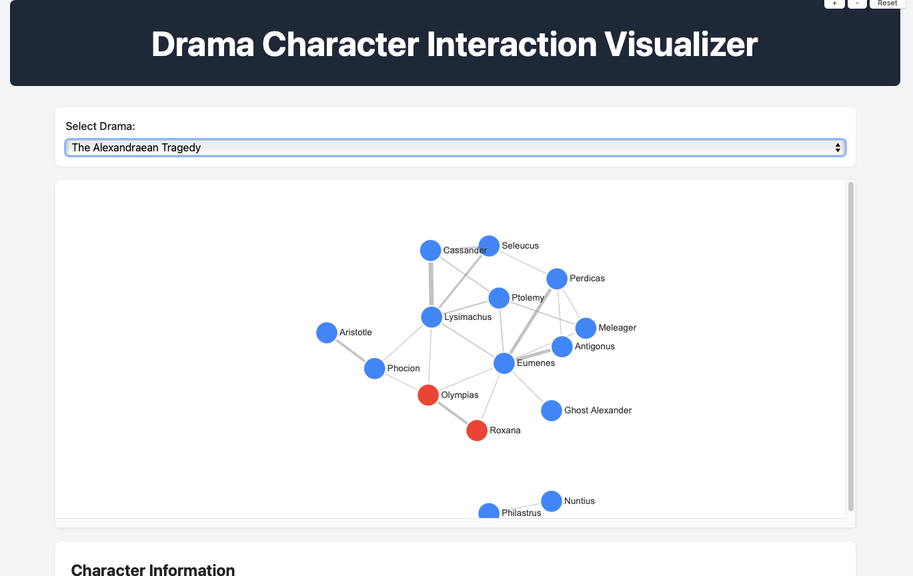
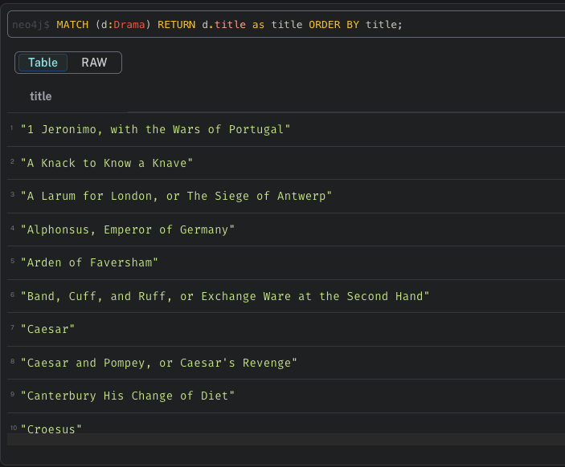
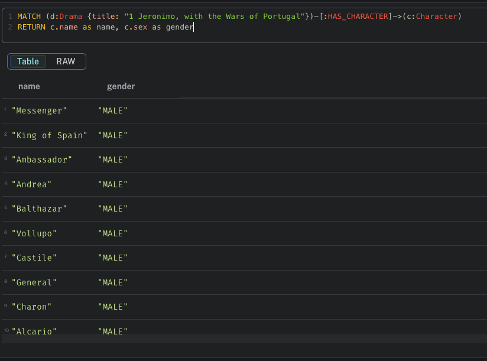
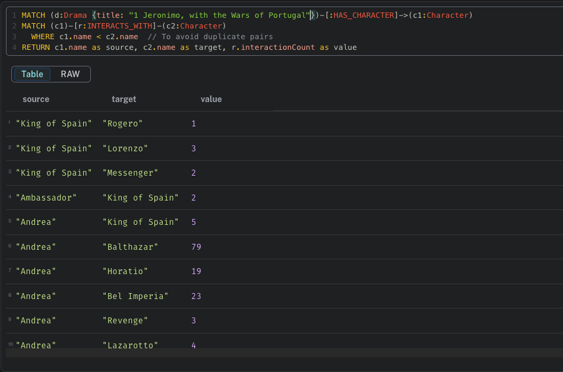

# Drama Character Interaction Analysis

- Project work for the course Text Technology @ Uni Stuttgart

## What is the project about?

- Dramas from earlier centuries can be hard to follow.
- They’re filled with archaic language and references long-lost to time.
- This often breaks the flow of the story and makes it difficult to grasp how characters relate to one another.
- But what if we could visualize those relationships instead?
- What if we could visualize which characters interact with one another?
- That’s what this project is about, turning complex, classical drama into a clear visualization of character
  interaction.

## Project Structure

- The project is organized as a monorepo with currently 4 different modules
- The `common` module contains the common utilities used across the project
- The `scraper` module contains the code related to the scraper
- The `processor` module contains code related to the processor
- The `visualizer` module contains code for visualizing character interactions
- The `api/` directory is the root directory storing the collection files for a popular REST API client
  called [Bruno](https://www.usebruno.com) which we use for testing

```
.
├── README.md
├── docker-compose.yaml
├── pom.xml
├── api/
├── common/
├── processor/
├── visualizer/
├── samples
│   ├── anon-a-larum-for-london.xml
│   └── drama.xml
└── scraper/
```

## Setup

### Docker Compose

- Easiest way to set up the project for use it to bring up the docker compose environment.
- Install [Docker Desktop](https://docs.docker.com/compose/)
- After setting up docker, please run the following command at the root of the project.

```shell
 docker compose -f docker-compose.yaml up -d
```

> ⚠️ If you get an error
`Cannot connect to the Docker daemon at unix:///Users/user1/.docker/run/docker.sock. Is the docker daemon running?`,
> please ensure docker is up and running.

- Please note that it will take some time for the eXist-DB to be up and running, please run the following command and
  verify the mentioned log appears

```shell
docker logs exist-db
```

```shell
25 Jun 2025 19:03:53,165 [main] INFO  (JettyStart.java [run]:289) - Server has started, listening on: 
25 Jun 2025 19:03:53,165 [main] INFO  (JettyStart.java [run]:291) - http://172.18.0.2:8080/ 
25 Jun 2025 19:03:53,165 [main] INFO  (JettyStart.java [run]:291) - https://172.18.0.2:8443/ 
25 Jun 2025 19:03:53,165 [main] INFO  (JettyStart.java [run]:294) - Configured contexts: 
25 Jun 2025 19:03:53,165 [main] INFO  (JettyStart.java [run]:300) - /exist (eXist XML Database) 
25 Jun 2025 19:03:53,168 [main] INFO  (JettyStart.java [run]:316) - /exist/iprange (IPrange filter) 
25 Jun 2025 19:03:53,168 [main] INFO  (JettyStart.java [run]:300) - / (eXist-db portal) 
25 Jun 2025 19:03:53,169 [main] INFO  (JettyStart.java [run]:316) - /iprange (IPrange filter) 
```

### Running the JARs

> ⚠️ As a pre-requisite, please have Java (preferably JDK v 21+) and maven installed
> 💡 If you have IntelliJ IDEA installed, open the code as a project will simplify the process

- Make sure you are at the root directory
- Run `mvn compile` or `mvn package` to compile the project
- For running each application, run their respective jars.
- Here is an example for the scraper module

```shell
java -jar scraper/target/scraper.jar
```

- This will bring up the scraper
- Similarly, one can bring up the processor and visualizer

> ⚠️ Please take care to bring up the dependent DB and modules for the application to work
> 💡 You can know if the services are up using the health endpoint
> `curl -s -X GET http://localhost:<port>/health`
> Refer the port mappings in [How to test the code section](#how-to-test-the-code)

## How to test the code

- You can test the code with a REST API Client like Bruno or using cURL
- All the cURL commands are provided in the file [curl-commands.sh](/api/curl-commands.sh)

- If you are using [Bruno](https://www.usebruno.com), open the folder `api` in bruno to view the collection

- Following are the port mappings for the services

| Service      | Port |
|--------------|------|
| eXist-DB     | 8080 |
| Scraper      | 8081 |
| Processor    | 8082 |
| Visualizer   | 8083 |
| Neo4j server | 7687 |
| Neo4j UI     | 7474 |

- Once the services and the database are up and running, perform a REST API PUT request to `/load/all` endpoint of the
  scraper to start the process.
- You can verify the data insertion using RESTful API provided by eXist-DB as
  documented [here](https://exist-db.org/exist/apps/doc/devguide_rest)

> 💡 Some handy sample data is provided in the directory `samples` if you want to explore the data

## Using the Visualizer

The visualizer module provides a web-based interface for visualizing character interactions in dramas:

1. Make sure the Neo4j database is running and contains processed drama data
2. Start the visualizer service:
   ```shell
   java -jar visualizer/target/visualizer.jar
   ```
3. Open a web browser and navigate to `http://localhost:8083`
4. Select a drama from the dropdown menu to visualize character interactions
5. Interact with the graph:
    - Hover over nodes to see character details
    - Click on a character to view detailed interaction information
    - Drag nodes to rearrange the graph

The visualizer provides a force-directed graph where:

- Nodes represent characters (color-coded by gender)
- Links represent interactions between characters
- Link thickness indicates the number of interactions



## Using the Neo4j UI

The graph data in Neo4j can be visualized in the UI using queries written in Cypher. 

1. Open the Neo4j UI `http://localhost:7474/` on a browser
2. Login using the user `neo4j` and password `your_password`
3. Query data using [Cypher](https://neo4j.com/docs/cypher-manual/current/queries/basic/)

Some interesting queries are 

1. Get a list of all drama titles

```cypher
MATCH (d:Drama) RETURN d.title as title ORDER BY title;
```



2. Get characters of a drama

Replace `$dramaTitle` with the name of the drama

```cypher
MATCH (d:Drama {title: $dramaTitle})-[:HAS_CHARACTER]->(c:Character)
RETURN c.name as name, c.sex as gender
```



3. Get character interactions in a drama

Replace `$dramaTitle` with the name of the drama

```cypher
MATCH (d:Drama {title: $dramaTitle})-[:HAS_CHARACTER]->(c1:Character)
MATCH (c1)-[r:INTERACTS_WITH]-(c2:Character)
  WHERE c1.name < c2.name  // To avoid duplicate pairs
RETURN c1.name as source, c2.name as target, r.interactionCount as value
```

